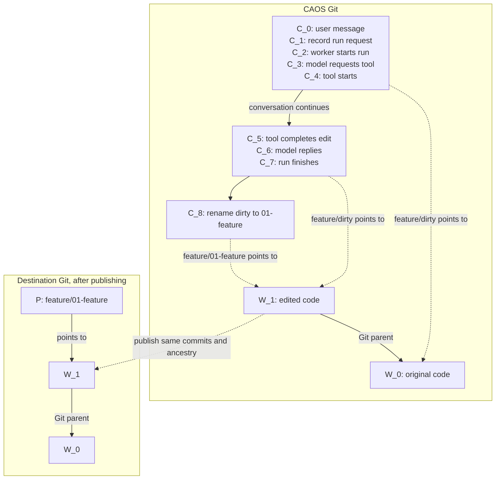

# Conversations, code stacks, and publication

This is the target design from the September 8 discussion. The current
implementation still uses flat workspace records and tree-based execution
bookkeeping; the changes below are not implemented yet.

| What | Where | How it is referenced |
| --- | --- | --- |
| `C`: conversation commit | CAOS Git | A conversation branch points to its latest `C`. |
| `W`: code commit | CAOS Git | A commit-valued entry anywhere in a conversation tree points to `W`. |
| `P`: publication branch | Destination Git repository | A branch inferred from a stack entry's path points to the published `W`. |

The chain of `C` commits records the conversation. Each `W` has its own code
tree and ordinary Git ancestry. Many consecutive `C` commits can refer to the
same `W`: a model response or tool-start event need not change any code.



Each listed `C` is a separate commit; grouped commits happen to reference the
same code. The numbered entry marks a PR boundary. Naming it does not create
another `W`, and a PR may contain many code commits between boundaries.

## Conversation commits

A conversation separates **canonical content** from **execution history**:

- The tree contains the current transcript, title, ordinary files, and code
  references. These are the things we edit, compact, or reconcile when merging
  conversations.
- Structured commit messages record events: run requests, worker claims,
  tool calls and results, background computations, and subagent lifecycle.
  They do not need duplicate mutable records in the tree.

A normal `C` parents the previous `C`. A new conversation starts from the fixed
genesis commit `G3`; a fork starts from its source conversation commit.
Conversation merges retain both parent histories and reconcile canonical tree
content. Fork provenance comes from history rather than a second copy in
`.caos/identity.json`.

Conversation parent edges never point to `W`. Code references live in the tree.

### Starting and running an agent

Starting a run still has three steps:

1. Commit the user message as `C_0`.
2. Build a computation request using `C_0` as its input snapshot. Computing
   the request hash does not create a conversation commit.
3. Create `C_1` whose commit message records the request hash, input snapshot,
   model/configuration, and queued status.

Step 3 is **turn admission**. The request hash depends on `C_0`, so putting that
hash inside `C_0` would make the two hashes depend on each other. The admission
event identifies the concrete run to execute.

When a worker takes responsibility for that run, another `C` records the
claim. Model responses, dispatched tool starts, tool completions, and run
completion likewise create conversation commits. An event-only commit may
reuse its parent's tree; validation must not reject it merely for that reason.

Turns identify agent runs; calls identify individual invocations; tasks identify
background computations or child conversations. Their status is derived from
events. The TUI shows the latest relevant state for each, without exposing the
entire execution log by default. Local indexes are disposable accelerators,
not another authoritative store.

Dispatched tools record a start and completion; immediate tools may complete
without a start. Results record both the returned value and any applied code
change. Calls can share cached computation but still need separate responses.

### Transcript, forks, and background work

The tree holds one canonical, unsharded transcript and its payloads. It need
not preserve a separate transcript shard for every pre-merge branch. A history
tool can inspect any earlier conversation commit when that context is needed.

Subagents have their own conversations and receive the requested code snapshots.
Spawn and completion events preserve the connection to the parent. The parent
can apply a child's changes to a working entry, or expose its result as a named
review boundary. Starting work, finishing it, and applying it remain separate.

Moving lifecycle records into commit messages avoids merging mutable status
files. It does not by itself settle which event wins after divergent histories
merge. Event identity, causal replay, and treatment of in-flight work at a
fork or merge still need a precise protocol.

### Canonical tree content

```text
.caos/
  format
  identity.json             # conversation ID
  title
  transcript/               # canonical, unsharded context and payloads

notes.md                    # ordinary conversation content
skills/                     # optional ordinary files
paintbot-feature/           # code references, described below
```

There is no required `files/` wrapper for ordinary content, and no
`.caos/workspaces/` registry. Turn, call, async-task, and subagent bookkeeping
move out of `.caos/requests`, `.caos/tools`, `.caos/async`, and
`.caos/subagents`. Publication has no canonical directory either.

## Code references and stacks

A code reference uses the existing Git commit-valued tree entry (gitlink, mode
`160000`). Its value is a `W`, not a live branch name or a text file containing
a hash. Its repository of origin is not part of the commit's identity.

References may appear anywhere. One task may need only `paintbot`; another may
organize several features and repositories into directories. Turning a single
reference into a stack means moving it into a directory and adding entries,
not creating a second kind of workspace object.

The TUI walks the conversation tree and displays its references in their
existing directory structure. It can filter for commit entries and let the
user select a directory or a particular entry. It needs neither a special flat
index nor an agent or worker to organize the tree before it can be browsed.

### A stack is a directory convention

Encourage meaningful feature names and zero-padded numeric prefixes:

```text
paintbot-feature/
  .base-url                 # repository URL + base branch/ref
  00-base          -> W_0   # exact base commit incorporated
  01-add-targeting -> W_1   # first PR boundary
  02-improve-it    -> W_2   # second PR boundary
  dirty            -> W_d   # current work, when present
```

- `.base-url` names the external repository and ref used for updates and, by
  default, publication. It changes infrequently.
- `00-base` records the exact base snapshot. Fetching a newer remote tip does
  not mean that snapshot has been incorporated.
- Numbered entries name review boundaries. Each may include many commits since
  the preceding boundary; their Git ancestry preserves those intermediate edits.
- `dirty` is the moving working entry. Every accepted edit still creates a real
  code commit; the entry itself is overwritten, not multiplied into
  `dirty-1`, `dirty-2`, and so on. Prior values remain in conversation history.

When a change is ready, rename `dirty` to the next numbered, descriptive entry.
Create a fresh `dirty` at that same commit when starting more work. There is no
need for separate working and publishing workspaces.

The TUI compares neighboring commit entries in name order: `01` against
`00-base`, `02` against `01`, and `dirty` against the last numbered entry.
Ordering and PR boundaries come from paths; actual ancestry comes from Git.
There is no per-entry `initial` field or stored upstream graph.

A standalone reference remains useful without a repository URL. Add a stack's
base and destination context when updates, comparison, or publication require it.
A directory convention must not become a requirement for browsing arbitrary
commit references.

### Edits, updates, and subagents

Tools receive explicit code snapshots and a target entry. Selection is local
UI state; a submitted operation captures its target and input commits so later
navigation cannot redirect it. Repository instructions and tools come from the
selected code, with conversation-owned context available separately.

Applying a proposal preserves its code ancestry and reconciles against the
captured base. Equal trees do not make ancestry redundant. A concurrent edit or
conflict must not silently overwrite the target.

Fetching resolves `.base-url` to a new candidate base. Incorporating it means
merging or rebasing the stack and updating `00-base`, the numbered boundaries,
and any working entry consistently. The TUI can report the last fetched tip;
it must not imply that it knows the current remote tip without fetching.

Subagents can work from the same boundary in parallel. Their results may be
combined into `dirty`, or retained as separate numbered boundaries when they
deserve separate PRs. The parent arranges and validates the resulting ancestry;
directory names alone do not integrate code.

### Multiple repositories

Keep coordinated stacks together, with a base for each repository:

```text
add-feature/
  library/
    .base-url
    00-base
    01-api
    dirty
  application/
    .base-url
    00-base
    01-use-api
    dirty
```

Making both code trees available to a tool is useful, but does not automatically
make the application's package manager consume the modified library.

The next step is a Git endpoint such as `https://gitcommit/<hash>`, reachable
from runners, that serves a commit and its history from CAOS. A consumer that
accepts Git dependencies can pin that URL instead of requiring an intermediate
push to GitHub. The agent can first update the library, then put its resulting
commit URL into the application's dependency configuration and build it.

Later, DEPS could refer to a sibling commit entry in the conversation tree and
project its pinned Git URL into a build input. That would avoid manually copying
hashes after each edit. Endpoint routing/access and package-manager or lockfile
integration need specification; DEPS automation follows the basic endpoint.

## Client startup

Start from the CAOS client/harness, independently of the code being edited.
There is no implicit `main` workspace or automatic import of the launching
checkout.

Provide an explicit TUI option to import a local Git tree/snapshot into the
conversation. Preserve its commit when one exists, choose a visible content
path, and insert a system message explaining what was made available. The exact
flag and handling of uncommitted files remain to be specified.

The same separation applies to cloud clients: boot from a stable CAOS client
repository/environment and attach target code afterward. The initial cloud
checkout must not accidentally become the conversation's code repository.
Reusing that bootstrap environment also permits caching independently of the
target repositories.

Credentials, server selection, and client caches stay local. They are not
conversation content.

## Publication

Publication derives its plan from a selected stack directory:

1. Use `.base-url` to identify the repository and base ref, and `00-base` as
   the incorporated snapshot.
2. Derive branch names from entry paths, such as
   `paintbot-feature/01-add-targeting` and `paintbot-feature/02-improve-it`.
3. Publish numbered boundaries in order. The first PR targets the external
   base branch; each later PR targets the preceding boundary's branch.

`00-base` is not a PR. `dirty` is excluded until explicitly made into a review
boundary. Publication preserves the existing `W` commits and their ancestry;
it does not squash or invent an extra code commit at each boundary.

The TUI previews the inferred destinations and diffs before publishing. Preparing
a boundary can integrate its base and run the appropriate checks. Publishing
requires coherent ancestry, resolved conflicts, and entries that still point
to the prepared commits. Concurrent remote updates must not be overwritten.

There is no `.caos/publications/` tree or per-reference publication config.
Find existing PRs from their repository and inferred branch names. After an
interrupted push, inspect the destination refs before retrying; any execution
events needed for recovery belong in commit history, not canonical files.

Path-based naming still needs rules for invalid Git ref characters, collisions
between conversations, and renamed entries with existing PRs. Destination
overrides, if needed, should be explicit rather than reviving hidden defaults.

## Implementation work still to specify

- Editing and materializing commit references through ordinary tools.
- Event-message schema, replay across conversation merges, and active-work
  behavior at forks and merges.
- Exact `.base-url` syntax, import flags, stack-update conflict recovery, and
  branch-name collision/rename handling.
- Format version and migration from existing transcripts, workspace configs,
  lifecycle records, and publication receipts. Historical commits stay intact;
  do not silently reinterpret old histories as the new format.
- Object retention: references in a conversation tree are not Git parent edges.
  Define how code commits remain available through transport and GC.
- The Git-by-commit endpoint, followed by optional DEPS integration.

The existing workspace commands and demos describe the current implementation;
they must be revised when this model is implemented.
