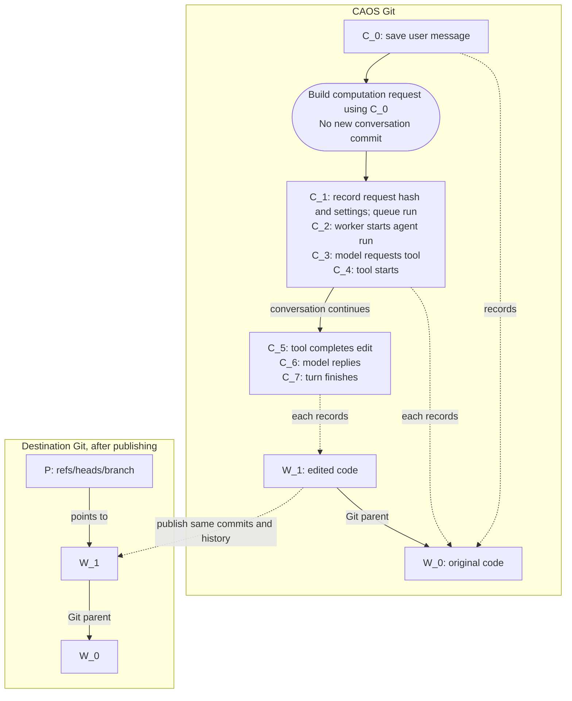

# Chat v3: conversation and code as separate histories

| What | Where | Referenced by |
| --- | --- | --- |
| `C` conversation commit | `caos` remote | `refs/caos/v3/conversations/<hex(id)>/head` |
| `W` workspace commit | `caos` remote | sha in a conversation commit's tree |
| `P` publication branch | destination repository | `refs/heads/<branch>` points to a workspace commit |

The chain of C_n records conversation. W_n records code changes.

Each conversation transition creates a new `C`, including model responses and
tool bookkeeping. Its tree holds the full conversation state so far. Many `C`
commits point to the same `W`; accepting a code change advances that pointer.
For example, a turn with one dispatched editing tool:



The flow follows execution order. Each listed `C` is a separate commit whose
Git parent is the previous `C`; building the computation request creates no `C`.
Grouped commits reference the same `W`. The model/tool loop can repeat within a
turn, and read-only tools leave `W` unchanged. Publication preserves commit hashes.

## Conversation commits

`C` commits contain:

- `tree`: complete conversation state, below.
- `parent`: exactly one. The fixed genesis commit `G3` for a new root, otherwise
  the previous `C` (or the source `C` when forking another conversation).
- `message`: transition kind, such as `message.append` or `tool.complete`.
- `author` and `committer`.

Conversation commits never have workspace commits as parents. They reference
workspace commit hashes through files in their trees.

### Transitions and turns

Each transition creates a new `C`. Its kind determines which changes are
allowed; validation rejects unrelated changes and no-op transitions.

Starting an agent run has three steps:

1. Commit the user message as `C_0`.
2. Build a computation request using `C_0` as its input snapshot. This computes
   the request's hash without creating another conversation commit.
3. Create `C_1` recording that request hash, its input snapshot, model and
   configuration, and queued status. This marks the run as active.

Step 3 is called **turn admission**. It needs a separate commit because the
request hash depends on `C_0`: storing it inside `C_0` would make the two hashes
depend on each other. The queued record identifies the concrete run to execute;
it is more than a status flag.

When a worker takes responsibility for the queued run, it records **turn claim**
as another `C`, changing the run's status to running. It then calls the model,
records its response, and executes its tools, repeating until the turn finishes
or fails. Interruptions are handled at worker boundaries.

Dispatched tools record `tool.start` before execution and `tool.complete`
afterward. Immediate tools can complete without a start record. Results record
both what the tool returned and how its changes were applied.

### Background work and subagents

`run_async` returns a task handle while computation continues. A subagent is a
separate conversation rooted at `G3`; its identity names the parent conversation,
parent commit, and spawning call. It receives the selected workspace, if any,
but does not inherit the parent's transcript or files.

Completion is recorded in the parent. Harvesting applies child changes to an
existing workspace; promotion creates a separate workspace for review.

Bookkeeping has three concepts:

- **Turns:** model loop, interruption, and outstanding calls. These records
  are distinct from CAOS computation requests.
- **Calls:** arguments, responses, applied changes, and an optional task reference.
- **Tasks:** shared pending/terminal status, results, cancellation, and recovery.
  Computations and child conversations are explicit variants. Conversation
  tasks retain their spawn inputs, terminal checkpoint, and application history.

Launching, finishing, and applying work are separate events. Calls identify
occurrences; computation hashes identify content, so calls can share cached
work but still need separate responses. Immediate tools need no extra task
record. Recovery polls pending tasks through one path; terminal notifications
share idempotence checks. Variant-specific data and validation remain separate.

### Forks, titles, and archiving

A fork starts a new identity from an existing `C`. The source must have no
active turn, unfinished tool execution, or pending async task or publication.
Completed records are allowed. Running child records are dropped from the
inherited state. Renaming changes `.caos/title`.

Archiving moves a conversation out of the active list without deleting its
history.

### Validation

JSON records use canonical bytes so hashing is stable. Readers check the commit
and reconstruct its declared transition; the resulting tree must match. See
[record formats](../rust/crates/conversation-protocol/src/v3/records.rs) and
[validation](../rust/crates/conversation-protocol/src/v3/validate.rs) for exact rules.

## Workspace commits

A conversation has zero or more named workspaces. Each points to a `W`: a Git
commit containing a code tree, parents, message, author, and committer. Edits
create descendant commits; merges can have two parents. The pointer in `C`
tracks the current head without requiring a separate named workspace branch.
Each workspace also records its immutable starting commit as `initial`.

### Sources and upstreams

Attaching code imports existing commits and ancestry without rewriting them or
changing the local checkout. A branch attachment remembers its upstream; an
attachment by commit stays pinned. Workspace inputs cannot contain reserved
`.caos` entries other than `.caos/conflicts`.

`config.json` keeps three independent fields:

- **Source:** an optional pinned locator, such as
  `git+https://github.com/team/repo.git?rev=<full-commit-sha>`. It uses the
  same parser as `:@@=`, but workspace attachment imports the commit and its
  ancestry, not an evaluated tree. Mutable refs, `path:`, and `dir=` are
  not workspace sources.
- **Upstream:** a repository branch or another workspace, plus the exact
  commit already integrated. This is a moving integration relationship;
  the source locator remains pinned.
- **Publication:** a repository, destination branch, and optional PR base
  (repository default, named branch, or parent workspace). The host derives
  defaults until the destination is chosen or published, then remembers it.
  Choosing a PR base does not change which upstream future updates integrate.

Workspace upstream dependencies must stay within a repository and cannot form
cycles. A workspace with dependents cannot be removed. For a stacked PR, the
parent's publication destination supplies the child's PR base.

### Selecting and creating workspaces

`Ctrl+O` or `/workspace` opens the picker. From the selected workspace:

- **Create** starts at its incorporated upstream commit, or `initial` if it has
  no upstream. It starts a separate change without the selected workspace's edits.
- **Copy** starts at its current commit and retains its upstream relationship.
- **Stack** starts at its current commit and makes the selected workspace its
  upstream.

All three inherit the pinned source and clear the publication destination.
`/workspace create <name> <revision>` starts at an explicit revision.
`/workspace attach <name> <repository> [<branch>|<commit>]` attaches a repository;
a pinned locator can replace the repository and revision arguments:
`/workspace attach <name> <locator>`.

The changes view compares the current commit with its incorporated upstream
commit, falling back to `initial`. Rollback can return to a previously recorded
workspace commit that descends from `initial`; it restores that commit's upstream
checkpoint while retaining the publication destination.

Selection is local UI state. A submitted turn captures its focus; with multiple
workspaces, tool calls name their target. Switching selection cannot redirect
an in-flight call. Navigation and informational commands do not send messages.

Each workspace supplies its own AGENTS.md and repository tools. Cross-workspace
bash inputs are immutable snapshots; only the target workspace's output is
adopted. Named repository refs are captured at turn start.

### Applying changes and updating stacks

Tools, subagents, and `/update-tree` use the same reconciliation rules. A
proposal must descend from its declared base. Already-applied proposals do
nothing; compatible descendants advance directly; otherwise try a three-way
merge. A conflict records the candidate and leaves the workspace pointer alone.
Equal trees are not enough to discard a commit: its ancestry may matter.

`/update-tree` includes local committed and uncommitted changes, using the merge
base with the workspace. Unrelated histories or multiple merge bases are errors.

`/workspace update [<name>|--all]` integrates upstream changes in dependency
order. Each workspace head and incorporated upstream commit update together.
An upstream rewrite or conflict stops the batch; earlier successful updates
remain. Resolve conflicts with the merge tool, then retry.

A hash written in `C` does not keep `W` reachable to Git's garbage collector.
CAOS currently disables automatic Git GC; retention and erasure policy remain
undesigned.

## Publication branches

Publishing points a destination branch at a workspace's existing commit.
The current `preserve` policy keeps its ancestry and creates no extra code
commits. It records outcomes in `C`, leaving workspace pointers unchanged.

Destinations can be configured. Default names are `caos/<id>` for a single
workspace and `caos-workspaces/<id>/<workspace>` for multiple workspaces;
existing publication destinations are retained.

### Preparing PRs

`Ctrl+P` previews workspaces, destination branches, and PR bases. Select which
to publish; parents publish before dependents. Each selected workspace gets a
preparation turn to merge its PR base if needed, then build and test.
Preparation can advance `W`.

Publication requires the base's ancestry, no conflicts or `.caos` entries, and
an unchanged prepared workspace. A dependent's parent must be published at its
current head. The host pushes and uses `gh` to open or reuse the PR. Cancellation
stops further work; completed publications remain.

`/publish-branch` skips preparation and PR creation. Squashing and publishing
conversation content are not implemented.

### Pushes and recovery

Publishing must preserve the destination branch's existing history. If someone
updates that branch while the push is being prepared, the push is refused.
If a push is interrupted, the host checks where the branch actually points
before retrying. The publication record says whether the push completed,
conflicted, or remains uncertain.

## Host and launcher inputs

The TUI starts `main` from the launching checkout's HEAD or `--base`/`--from`.
Without a checkout, or with `--empty`, it starts with no workspace. Line clients
use their caller's checkout and HEAD/`--base` defaults.

The TUI keeps its bundled harness in a separate client store. Attaching or
editing code never overwrites it. Checkout commands act on the original matching
checkout. Server and secret-store choices belong to the local client;
credentials are never copied into conversation or workspace trees.

## Storage reference

`C`'s tree contains:

```
# Identity and metadata
.caos/format                                          "caos-conversation-v3"
.caos/identity.json                                   ID, root/fork origin, and subagent parent/spawning call
# NOTE: Is fork info redundant? since can see in C_n history
.caos/title                                           displayed title

# Transcript
.caos/transcript/<shard>/<ordinal>-<message-id>.json  speaker, model, content blocks
.caos/transcript/<shard>/<ordinal>-<message-id>/      message payload files
# NOTE: Do away with shards; to access a history from a conversation branch pre-merge, use a tool

# Workspaces
.caos/workspaces/<name>/commit                        current code commit hash
.caos/workspaces/<name>/initial                       starting commit; fallback diff baseline and rollback limit
.caos/workspaces/<name>/config.json                   source locator, upstream/checkpoint, publication destination/base
# NOTE: no default workspace. We support at tui flag to load in a git tree from a location on-disk, and insert a system message by default indicating that it's there
# Usage note/clarification: can imagine that a common way of using workspaces is to have the agent use one as its working area (akin to disk for humans), and another workspace that moves less frequently and tracks clean commits ready for integration into the target repo
# TODO: The tui doesn't have a special index of workspaces; instead, we encourage agents to make per-feature/group subdirs (where the dirs are named to reflect the group). Outside of .caos. And the tui lets you select a dir
###

paintbot-feature/.base-url           # repo url:base branch
paintbot-feature/0-base              # commit sha corresponding to .base-url
paintbot-feature/1-add-targeting     # commit sha
paintbot-feature/2-improve-targeting # commit sha

paintbot-feature/dirty               # current work. it can add paintbot-feature/3-... when it wants to virtual-commit
# Also TODO: support https://gitcommit/<hash> that we, by virtue of controlling the runner, resolve
# Also TODO: for PR publishing, tui infers branch names from folder structure.
###


# Conversation-owned files
files/                                                files separate from workspace code

# Turns and calls
.caos/requests/<id>.json                              starting snapshot, model settings, calls, status, outcome
.caos/requests/active                                 active turn hash; absent when none
.caos/tools/<turn>/<round>/<call-id>.json             input workspace, optional task, status, result, applied changes
.caos/tools/<turn>/<round>/<call-id>/                 tool arguments and output files
## TODO: move these back to commit messages; only show latest. The goal is that anything that things in files need to get canonicalized/merged during a conversation merge

# Background work
.caos/async/<hash>.json                               computation task status and result
.caos/subagents/<child-id>.json                       conversation task, spawn inputs, result, application history

# Publication
.caos/publications/                                   destinations, planned commits, expected remote tips, outcomes
# TODO: remove this, ideally we can do it from our stack

```

### Compatibility

Turns and calls are stored under `requests` and `tools`; transition labels and
record field names retain those names. Computation and child records have
separate encodings but share lifecycle code. The combined task view is derived,
not stored alongside them.

Readers accept historical `origin` and repository/branch/base fields. An old
record without a repository uses the checkout's origin; new attachments bind
the repository explicitly.
