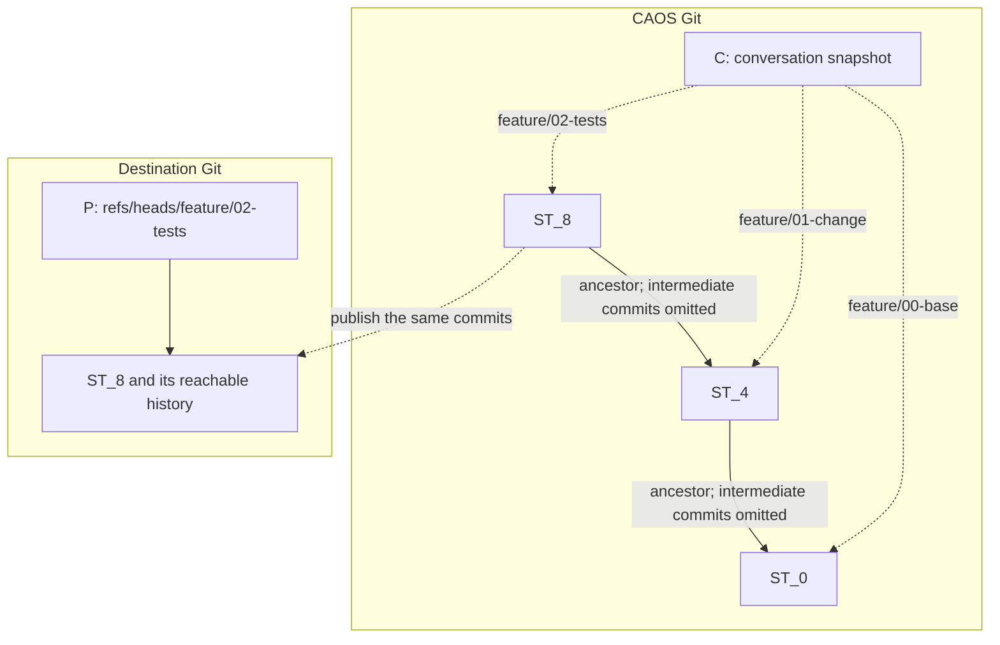

# Conversations and source trees

A conversation has one filesystem. It holds messages and protocol metadata under
`.caos/`, ordinary files such as notes and memories, and references to code.
The agent works in this filesystem; the TUI handles importing from the user's
machine, exporting local checkouts, and publishing to a remote repository.

| Name | Meaning |
| --- | --- |
| `C` | A conversation commit in CAOS Git. Its tree is the conversation filesystem; its commit message records the operation that produced it. |
| `ST` | A source-tree commit: an ordinary Git commit with code, parents, and a commit message. |
| `P` | A branch in the destination Git repository pointing to a published `ST`. |

A source-tree reference is a Git tree entry with mode `160000`, called a gitlink.
Its value is a commit hash, not a tree hash or a text file containing a hash.
The agent sees it as a directory containing that commit's files.

For example, one conversation tree might contain:

```text
.caos/                         conversation metadata and transcript
memories/project.md            an ordinary conversation file
imports/repo/base              gitlink -> ST_0
imports/repo/base.source.json  optional repository provenance
feature/00-base                gitlink -> ST_0
feature/01-change              gitlink -> ST_4
feature/02-tests               gitlink -> ST_8
```

If the agent calls `write` or `edit` on
`feature/01-change/README.md` and changes its contents, saving the tool result
automatically creates a new source-tree commit. Its tree contains the edited
files and its parent is the previously referenced commit, here `ST_4`. The
harness then records a conversation commit whose `feature/01-change` gitlink
points to that new commit. The agent does not separately commit or update the
gitlink; bash edits use the same save path.

Other references, including `00-base` and `02-tests`, stay unchanged.
An unchanged source tree keeps its existing commit. Many conversation commits
can therefore reference the same `ST`: messages and tool activity need not
change code.

The filenames name review points, not individual editing steps. Here the
boundaries point to `ST_0`, `ST_4`, and `ST_8`: there may be several edits and
merges between them. Each commit records parent hashes, through which its
history is reachable.



This example's boundaries share ancestry. Source histories can also branch and
merge; folder order imposes no ancestry relationship. Naming a review point
neither combines its commits into one nor discards their history.

## Conversation commits

A conversation ref, `refs/caos/v3/conversations/<hex(id)>/head`, identifies its
current `C` in CAOS Git. A normal update creates a commit parented by the previous
`C`, then advances the ref only if it still points to the expected head.

Each `C`'s tree is a complete snapshot of the conversation filesystem.
`.caos/transcript` holds its ordered messages; `.caos/title` holds its title.
Notes, memories, source-tree references, and other agent-owned content live
outside `.caos/`. Git shares unchanged objects between successive snapshots.
Agents can read conversation protocol files, but cannot edit them.

Execution events in commit messages record which computation ran, its input,
tool calls and results, and subagent activity. The TUI reads these events in
first-parent order to determine what is running or finished. An event can create
a new `C` without changing its tree.

For a user message and an agent turn:

1. Append the message and create `C_0`.
2. Form a computation request whose input is `C_0`. Computing the request hash
   creates no conversation commit.
3. Create `C_1` recording that request's hash and settings. This must follow
   `C_0`: putting the request hash in its own input would make the hashes depend
   on each other.
4. The worker records that it has started, creating another `C`.
5. Model responses, tool operations, and turn completion create further `C`
   commits. Dispatched tools such as bash record start and completion separately;
   inline tools such as read, edit, log, show, and diff record completion without
   a start commit. History tools use Git against the named source commit; revision
   names resolve only from the supplied ref snapshot.

Conversation parent edges connect conversation commits; source-tree ancestry
is carried by the `ST` commits referenced in their trees. Imports and saves
transfer source commits through CAOS's internal content-addressed refs, so each
source-tree reference does not need its own named branch.

## Starting a session

```sh
result/bin/caos tui \
  --llm-step:@=std/llm-step \
  --llm-call:@=std/llm-call \
  --server http://127.0.0.1:9090
```

The worker paths resolve in the client harness, independently of target code.
A fresh conversation can start empty and import code afterward. The optional
`--import <conversation-path>` flag imports the launching checkout; adding
`--base <revision>` imports that revision instead of disk changes.

Credentials, server configuration, caches, and checkout destinations stay on the
client machine. The agent's host-side requests are communicated as concrete TUI
commands for the user to run.

## Importing code with `/import`

The user enters this in the TUI:

```text
/import imports/repo/base /absolute/path/to/repo
```

The client then:

1. Reads the Git checkout's disk contents into a Git tree. This includes tracked
   edits and untracked files allowed by Git's ignore rules, preserves executable
   bits and symlinks, and excludes `.git`.
2. Reuses HEAD's exact commit if the tree is unchanged. Otherwise, creates a
   synthetic commit with the snapshot tree and HEAD as its parent. Call the
   resulting commit `ST_0`.
3. Imports the required Git objects and history into CAOS. The source checkout's
   files, index, and branches stay unchanged.
4. Creates a `C` adding a gitlink at `imports/repo/base` pointing to `ST_0`.
   When available, it also records repository provenance beside the gitlink.
5. Appends a message recording the import in another `C`, then pushes both
   conversation commits with one update of the conversation ref, conditional on
   its previous head. The TUI adopts the new head and displays the message as
   `CAOS`.

The activity box shows `Importing…` while this runs. After it finishes, the user
sends a message to continue the agent. Asking the agent to import in prose does
not execute the TUI command; it should respond with the exact command to enter.

To import a particular commit instead of local disk changes, supply a revision.
A repository URL imports the requested revision, or its default branch:

```text
/import imports/repo/base /absolute/path/to/repo main
/import imports/repo/base https://github.com/owner/repo.git main
```

Local imports require a Git checkout root with an existing HEAD; linked worktrees
work too. Plain directories, individual files, and checkout subdirectories are
not supported. Paths are relative to the TUI's launch directory or absolute.
Quote spaces; `~` and environment variables are not expanded. The conversation
destination must be unused.

### Repository provenance

`imports/repo/base.source.json` can record the repository URL and default branch.
For a local checkout, discovery reads `origin` and `origin/HEAD`; for a URL, it
reads the advertised default branch. Local paths and credential-bearing URLs
are omitted. This metadata stays beside the gitlink, outside the imported code.

Provenance can supply the repository when publishing later. Importing and
working require no publishing destination. Imports conventionally remain
unchanged under `imports/`, separate from feature work.

## Ordinary agent work

Every command starts from the conversation root. File tools and grep use paths
such as `memories/project.md` or `feature/01-change/README.md`; grep can descend
through gitlinks. Bash can choose a relative `cwd` for one call, but its declared
`paths` are always conversation-relative. Declared directories include their
descendants; undeclared content stays lazy until requested.

To start work, the agent uses ordinary operations:

```sh
mkdir -p feature
cp -a imports/repo/base feature/00-base
cp -a imports/repo/base feature/01-change
```

The copies initially reference the same `ST_0`. Suppose the agent then writes
`feature/01-change/MYFILE.txt`:

1. The harness exposes the requested source-tree files as a writable directory.
2. The tool writes the file.
3. Saving the result creates `ST_1` with the edited tree and `ST_0` as parent.
4. The conversation update changes `feature/01-change` to point to `ST_1`.
   `imports/repo/base` and `feature/00-base` keep their original references.

Writing `memories/project.md` changes the conversation tree directly and creates
no source-tree commit. One tool call can edit ordinary files and several source
trees together. Several shell commands inside that call are saved together.

The harness tracks the original commit in a directory extended attribute.
`cp -a` and `mv` preserve it. An unchanged directory retains its exact commit,
including signatures; an edited one becomes a child commit. Copying without
preserving this attribute produces ordinary files and loses the gitlink boundary.

The harness prepares requested files before each tool call and stores the
result through `caos put`. To reference a commit
already stored in CAOS, an agent can use `caos get-hash <commit> /cas/source` and
link that CAS object into the conversation tree; the next tool call exposes it
as a directory.

Repository tools are called with `run_tool` at a conversation-relative path,
such as `feature/01-change/caos-tools/test`. The harness resolves the tool from
the captured snapshot. Its input is the outermost source tree containing that
path; a tool outside source trees receives the conversation tree.

### Preparing a stack

Once the first change is ready, the agent copies it and edits the copy:

```sh
cp -a feature/01-change feature/02-tests
```

Now `01-change` remains the first review boundary while `02-tests` advances.
Each gitlink names a commit snapshot that may include several editing commits.
The user describes the desired work and PR structure; the agent organizes these
copies itself.

Sibling gitlinks sort by filename. By convention, the first is the starting
base and each later entry is a review boundary. Number prefixes make the order
clear; names such as `dirty` have no special behavior. Folder order neither
merges Git histories nor chooses a remote PR base.

## Subagents and merging their work

`spawn_agent` creates a separate conversation with its own ref and transcript.
It starts with a snapshot of the parent's ordinary content and source-tree
references, or only the paths selected by the parent. Selected paths keep their
names. Source trees are selected as whole gitlinks.

The child receives the task prompt supplied to `spawn_agent` and the harness
instructions, but
not the parent's transcript. Its copies initially reference the same immutable
`ST` commits. Editing a child reference creates new source commits and advances
only the child's conversation; the parent's files and references stay unchanged.

After the child finishes, `harvest_agent` compares its final content with its
starting content and applies that difference to the parent. It can restrict the
application to selected paths. The child's transcript and protocol metadata are
not copied into the parent.

Harvesting preserves unrelated parent edits and reconciles concurrent source-tree
changes. The operation is atomic: if reconciliation conflicts, CAOS retains the
proposal for resolution without partially installing it. The parent then
inspects the result, resolves conflicts, and runs checks.

For two independent changes intended as a PR stack, the parent can:

1. Give two children bounded tasks against the same starting source.
2. Harvest the first child's change into `feature/01-change` and check it.
3. Preserve that snapshot by copying it to `feature/02-tests`.
4. Apply the second child's source commit to `feature/02-tests` using a merge,
   then check the combined result.

Harvest applies changes at their existing paths; it does not choose PR
boundaries or redirect changes into a differently named snapshot. The parent
owns that organization unless it delegates it explicitly.

### Resolving source-tree conflicts

A source-tree merge tool names the target gitlink and the other commit explicitly.
A merge preserves both parents. If it conflicts, the source tree contains inline
markers where applicable and a `.caos/conflicts` ledger listing unresolved paths,
including conflicts without text markers.

The agent fixes each path and removes its ledger rows. Saving the resolution
removes an empty ledger and prunes its `.caos` directory if empty. Other metadata
and unresolved entries remain. This source-tree ledger is separate from the
protected `.caos` at the conversation root.

Fetching or importing a newer branch only makes that commit available. Integrating
it into a feature requires an explicit merge or rebase.

## Viewing files and working locally

`Ctrl+O` opens a read-only browser of the conversation filesystem, including
protocol files. Ordinary files show contents. A directory containing sibling
gitlinks previews its newest two boundaries in descending filename order.
Selecting a boundary compares it with the next older sibling; the oldest shows
content. Inside a comparison, files show diffs, including deletions, with the
compared paths and hashes identified.

The browser pins the conversation head when opened; refresh reads the latest
head. Its comparisons are between named snapshots, not against a remote PR base.

To work in a host checkout, the user enters:

```text
/checkout feature/01-change /absolute/path/to/checkout
```

This is a TUI command. It imports the needed objects into the local checkout and
checks out the named source commit with detached HEAD. The destination must be
a clean Git checkout or an empty/new directory.

The client remembers that destination locally, keyed by server, conversation,
and gitlink path. A later `/checkout feature/01-change` can reuse it.
`/update-tree feature/01-change <message>` commits edits in that path's remembered
checkout, submits them back to that source, and continues the conversation with
the user's message. The source path is explicit in both commands.

Browser selection does not choose checkout or publication targets, and does not
change the agent's execution context.

## Publishing with `/pr`

The user enters:

```text
/pr feature/01-change main
```

The client:

1. Reads the commit referenced by `feature/01-change`. That path also supplies
   the proposed remote branch name.
2. Determines the destination repository from an explicit optional URL or
   unambiguous import provenance matching the oldest sibling's commit.
3. Fetches the requested base branch, here `main`, and checks the source commit.
4. Shows the source path and hash, repository, branch, and base for review.
5. On Enter, rechecks the selected snapshot and remote state, pushes the exact
   source commit with its history, and opens or updates the PR using the client's
   Git and GitHub credentials. Escape cancels.
6. Records the confirmed push as a `CAOS` message. Successful PR creation or
   update adds another message with the PR URL, branch, and base.

The full syntax is `/pr <conversation/gitlink> <base-remote-branch> [remote-URL]`.
The base branch is explicit. The optional remote is a repository URL, not a
local remote name such as `origin`. Missing or ambiguous provenance requires
that URL. The preview shows destination metadata, not a full PR diff.

For a stack, publish each boundary in order:

```text
/pr feature/01-change main
/pr feature/02-tests feature/01-change
```

The preceding branch must exist remotely before it can serve as the next base.
Publication does not squash source history or change the conversation's gitlinks.
`/publish-branch <conversation/gitlink> [remote-URL]` provides the same preview
and branch push without a PR or base-branch requirement.

### When the PR base needs integrating

The source and remote base must share Git history. If the source does not contain
the fetched base tip, the preview offers a different action:

1. On Enter, import that exact base commit under `imports/pr-base-<commit>/base`.
2. Send a message asking the agent to merge or rebase it into the named source
   and run checks.
3. After integration, the user runs `/pr` again to review the result.

That confirmation imports and sends the message; it publishes nothing. A failed
import sends no message. The handoff preserves the user's draft and stays in the
original conversation.

Before integrating, the agent checks the full proposed PR scope. Merging upstream
retains inherited branch changes; moving only a small requested edit onto a new
base requires deciding which changes to carry over.

Publication rejects changed snapshots, remote drift, unrelated histories,
conflict markers, and any remaining source-tree `.caos` entry. It never cleans
files or rewrites the reviewed commit at push time. Interrupted pushes are
checked against the destination before retrying, and failed PR operations do
not record a successful PR.
