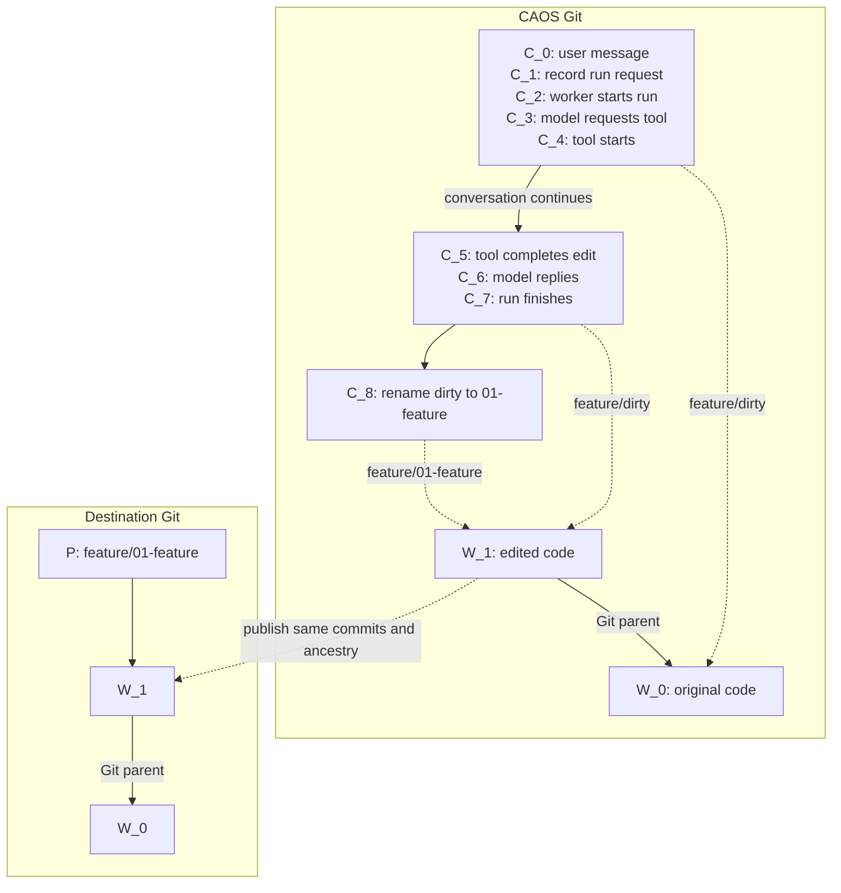

# Conversations, code stacks, and publication

Implemented conversation format v4, based on the September 8 discussion.

**The goal is to delete much of the current workspace and lifecycle machinery.**
Keep three things: conversation commits, code commits, and ordinary publication
branches. Directories organize code references by convention; they are not a
new collection of workspace objects.

| Thing | Where | Meaning |
| --- | --- | --- |
| `C` | CAOS Git | Conversation content in its tree; execution events in its commit message. |
| `W` | CAOS Git | An ordinary code commit, referenced by an entry in a conversation tree. |
| `P` | Destination Git | A publication branch pointing to an existing `W`. |

Many `C` commits can reference the same `W`. Execution bookkeeping does not
create a code change. A named PR boundary can span many `W` commits.



Each listed `C` is a separate commit. Naming the review boundary creates a
new `C`, but no new `W`.

## Conversation commits

**Put things in files when we want a canonical, editable, compactable version.
Put execution history in commit messages.**

The tree contains the title, canonical transcript, ordinary conversation files,
and code references. These are the things a future conversation merge would reconcile. Keep protocol metadata under `.caos/`; ordinary content, including code
references, belongs outside it. No `files/` wrapper is required.

Structured commit messages record run requests, worker claims, tool calls and
results, and background/subagent activity. The TUI derives the latest relevant
state for each operation. A disposable local index can accelerate that view;
do not also store mutable request, call, and task records describing the same
execution in the tree.

A normal `C` parents the previous `C`; a new root starts from `G3`, the fixed
genesis commit. Forks retain their source history through a Git parent. Provenance is derived
from that edge, not stored again in `.caos/identity.json`.
Conversation parent edges never point to code commits.

Keep one canonical, **unsharded** transcript under `.caos/transcript`. Inspect earlier or pre-merge
conversation commits through a history tool instead of retaining every branch's
transcript as another shard in the current tree.

### Why recording a run is a separate commit

1. Commit the user message as `C_0`.
2. Build a computation request using `C_0` as its input snapshot. Computing
   its hash creates no conversation commit.
3. Create `C_1` with an event recording that request's hash, input snapshot,
   model/settings, and queued status.

The request hash depends on `C_0`; including it inside `C_0` would make the
hashes depend on each other. Step 3 identifies the concrete run to execute.

The worker subsequently records that it has started the run. Model responses,
tool starts/completions, and run completion also create `C` commits. An
event-only commit can reuse its parent's tree.

Events are replayed in first-parent order, never by timestamp. A fork starts a
new execution context while retaining ancestral tool results needed by its
canonical transcript. Forking requires a quiescent request; it does not resume
the source's background work. Conversation merging and transcript compaction
commands remain follow-ups; this version supports code merges.

## Code references and stack directories

Use existing Git commit-valued tree entries (gitlinks, mode `160000`), not
text files containing hashes. A reference's value is a `W`; that commit's
identity does not depend on the repository from which it was fetched.

References may occur anywhere. The TUI discovers them by walking the
conversation tree and presents that same hierarchy, optionally filtered to
commit entries. It needs no special workspace index and no worker to reorganize
content before it can be browsed.

A single reference such as `paintbot` is enough for simple work. When useful,
move it into a feature directory and follow this convention:

```text
paintbot-feature/
  .base-url                 # two lines: repository URL, then base branch
  00-base          -> W_0   # exact incorporated base
  01-add-targeting -> W_1   # first PR boundary
  02-improve-it    -> W_2   # second PR boundary
  dirty            -> W_d   # current work, when present
```

`.base-url` says where to fetch and publish. `00-base` says which commit has
actually been incorporated. They are distinct: fetching a newer remote tip
does not integrate it.

Numbered entries are review boundaries, not individual edits. Use descriptive
names and zero-padded numbers so lexical order is useful. The TUI compares each
boundary with its predecessor, and `dirty` with the last boundary. Intermediate
code commits remain in ordinary Git ancestry.

Keep **one moving `dirty` reference**. Each accepted edit produces a real code
commit and updates its value; previous values remain in conversation history.
When ready, rename it to the next numbered boundary. Start another `dirty`
from that commit when needed. There is no separate working-versus-publishing
workspace pair.

Creating, copying, renaming, or removing references is ordinary tree editing.
Convenience commands can perform those edits without adding persistent object
types or separate protocol operations for each arrangement.

### Editing, updating, and delegating

Tools receive explicit snapshots and a target reference. Capture these when
work starts so changing UI selection cannot redirect an in-flight operation.
Apply proposals against their captured base, preserving code ancestry and
handling concurrent changes or conflicts explicitly.

Updating a stack fetches the branch in `.base-url`, merges its changes through
the ordered boundaries and `dirty`, and updates all references in one conversation
commit. A conflict leaves the conversation unchanged. There is
no additional upstream graph or checkpoint database. The UI can show the last
fetched tip; it cannot know an unfetched remote update.

Subagents have separate conversations seeded with the requested snapshots.
Record their relationship and completion in events. Combine their results into
`dirty`, or expose them as separate numbered boundaries when they deserve
separate PRs. Directory ordering does not replace actually integrating their
Git histories.

### Starting a client

Boot from the CAOS client/harness, independently of target code. There is no
default `main` workspace or implicit import of the launching checkout.

Use `caos tui --import feature` to load the committed HEAD of the checkout at
`feature/dirty` (or choose a commit with `--base`). A system message states what
was provided. Local uncommitted edits are not included. Cloud
sessions likewise start from a stable CAOS client repository/environment and
attach target code afterward. This also makes bootstrap caching independent
of the target repositories.

Credentials, server choice, and client caches remain local.

## Publication

Select a stack directory and derive the plan:

- Repository and external base: `.base-url`.
- Branch names: entry paths, such as `paintbot-feature/01-add-targeting`.
- PR bases: the external branch for the first boundary, then the preceding
  boundary's branch for each subsequent PR.

Exclude `00-base` and `dirty`. A numbered boundary points at an existing code
commit; publication preserves it and its ancestry. Naming a boundary does not
squash the intervening commits.

Preview destinations and diffs, prepare and check the selected code, and publish
in order. Verify that references still match the prepared commits and that
remote branches have not moved unexpectedly.

Find existing PRs by repository and inferred branch. Inspect destination refs
after an interrupted push before retrying. Any recovery events belong in commit
history. Do not recreate a canonical publication-state directory or per-entry
destination records.

Reject invalid or colliding derived branch names visibly. A renamed path changes
the proposed destination; show that in the preview rather than maintaining a
hidden second identity for the branch.

## Deferred multi-repo work

Separate directories can attach separate repositories. Making one package
consume unpublished code from another still requires dependency configuration;
a Git-by-hash endpoint and automatic DEPS projection are outside this change.

## What this removes

- Flat workspace registration and `.caos/workspaces/<name>/commit|initial|config`.
- Per-workspace source, upstream, and publication object graphs.
- Separate working/publishing workspaces and special create/copy/stack/promote
  persistence machinery.
- Mutable lifecycle files under `.caos/requests`, `.caos/tools`,
  `.caos/async`, and `.caos/subagents`.
- Transcript shards and duplicated fork provenance.
- `.caos/publications` and stored publication defaults.

Implement this by deleting those representations and using tree edits, Git
history, and derived views. Moving the same structures behind new names would
miss the goal.

## Commands and format transition

- `/workspace` or `/workspace list`: browse commit-entry paths.
- `/workspace use <path>`: select a code snapshot.
- `/workspace attach <directory> <repository> [branch|commit]`: create
  `.base-url`, `00-base`, and `dirty` in that directory.
- `/workspace create <path> [commit]`: copy the selected snapshot, or use an
  explicit commit. `copy` is an alias for copying the selected snapshot.
- `/workspace rename <source> <destination>`: move a reference.
- `/workspace seal 01-description`: rename selected `dirty` to a PR boundary.
- `/workspace update [directory|--all]`: incorporate the fetched base atomically.
- `/workspace rollback <path> <commit>` and `remove <path>`: move or remove a ref.
- `Ctrl+P`: preview and publish the selected directory's numbered boundaries.

Inline file tools address conversation paths directly, traversing code references
such as `feature/dirty/README.md`. An explicit `workspace` makes their paths
relative to that code tree. Bash and repository tools take a target reference.

The format marker is `caos-conversation-v4`. Old Git objects are preserved;
use the previous build to open v3 conversations. There is no implicit migration
or dual-format persistence. The internal v3 module and ref namespace names are
retained; the format marker determines how a conversation is read.

Run `dev/demo-workspaces` for local fixtures or `dev/demo-subagent-stack` for
the guided subagent example.
