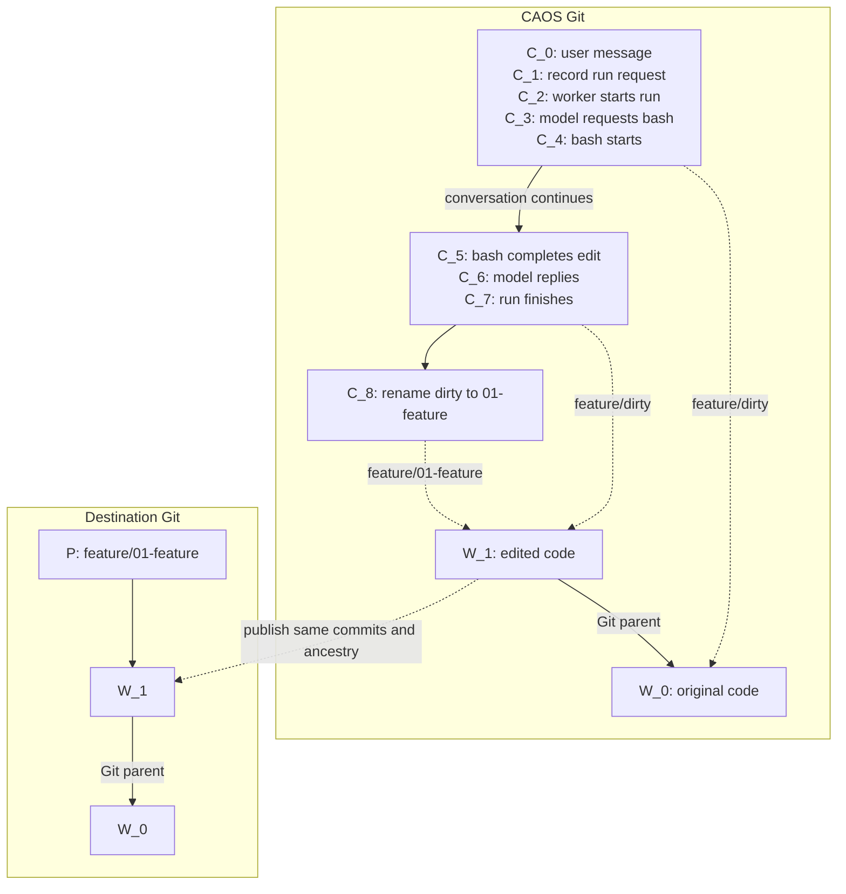

# Conversations, code stacks, and publication

Conversations record content and execution in Git. They reference ordinary
code commits, organized into directories that define review boundaries and
publication destinations.

| Thing | Where | Meaning |
| --- | --- | --- |
| `C` | CAOS Git | Conversation content in its tree; execution events in its commit message. |
| `W` | CAOS Git | An ordinary code commit, referenced by an entry in a conversation tree. |
| `P` | Destination Git | A publication branch pointing to an existing `W`. |

Many `C` commits can reference the same `W`. Execution bookkeeping does not
create a code change. A named PR boundary can span many `W` commits.



This example dispatches bash to a worker; each listed `C` is a separate commit.
Naming the review boundary creates a new `C`, but no new `W`. This example
assumes publication preparation makes no further code changes.

## Conversation commits

**Trees hold canonical content; commit messages hold execution history.**

The tree contains the title, canonical transcript, ordinary conversation files,
and code references. Protocol metadata lives under `.caos/`; ordinary content
and code references live directly at paths outside it. The format marker in
`.caos/format` is `caos-conversation-v4`.

Structured commit messages record run requests, worker claims, tool calls and
results, and background/subagent activity. The TUI derives the latest relevant
state for each operation by replaying those events.

A normal `C` parents the previous `C`; a new root starts from a fixed genesis
commit. Forks retain their source history through a Git parent, which identifies
their origin. Conversation parent edges never point to code commits.

One canonical, **unsharded** transcript lives under `.caos/transcript`.
Earlier versions are available through conversation history.

### Why recording a run is a separate commit

1. Commit the user message as `C_0`.
2. Build a computation request using `C_0` as its input snapshot. Computing
   its hash creates no conversation commit.
3. Create `C_1` with an event recording that request's hash, input snapshot,
   model/settings, and queued status.

The request hash depends on `C_0`; including it inside `C_0` would make the
hashes depend on each other. Step 3 identifies the concrete run to execute.

The worker subsequently records that it has started the run. Model responses
and run completion also create `C` commits. Dispatched tools, such as bash,
record separate start and completion commits. Inline tools, such as `read`
and `edit`, record completion without a separate start commit. An event-only
commit can reuse its parent's tree.

Events are replayed in first-parent order, never by timestamp. A fork starts a
new execution context while retaining ancestral tool results needed by its
canonical transcript. Forking requires a quiescent request; it does not resume
the source's background work.

## The agent's filesystem

Commands start at the conversation root. Memories, skills, notes, and source
trees share one path space. A commit-valued entry appears as a directory whose
contents are that commit's tree; a regular file containing a SHA remains a file.
Nested commit entries follow the same rule.

The file tools and grep use conversation-relative paths, such as
`memories/project.md` or `feature/dirty/README.md`. Grep traverses source trees.
Bash runs from this root, with an optional relative `cwd` for a single call.
Its `paths` list is always relative to the conversation root: declared
directories include their descendants; undeclared contents remain lazy.

Use ordinary filesystem operations to organize content:

```sh
mkdir -p feature
mv feature/dirty feature/01-parser
cp -a feature/01-parser feature/dirty
```

A writable projection records each source directory's original commit in an
extended attribute. `mv` and `cp -a` preserve it. On storage, an unchanged
directory retains the exact commit, including signatures; edited content
becomes a child commit. Ordinary directories remain Git trees. Copying without
preserving extended attributes copies files but loses the commit boundary.
This metadata is local to the projection, not another conversation registry.

Inside bash, `caos checkout <commit> <destination> <paths...>` adds a commit
already available in CAOS; `.` loads its whole tree. Local or remote repository
imports happen through the client. No host filesystem path is implicitly
available inside a worker.

Call a repository tool with `run_tool` and a conversation-relative path, such
as `feature/dirty/caos-tools/test`, plus its arguments. The harness resolves
the tool against the captured snapshot and dispatches its content-addressed
request. Its input is the outermost source tree on that path: the first
commit-valued entry reached from the conversation root, even if the tool lies
inside another gitlink. A tool outside source trees receives the conversation
tree. Repository tool schemas and instructions are shown with their owning paths.

A shell result may change conversation files and several source trees together.
Apply it atomically against the captured input: retain concurrent unrelated
edits, reconcile concurrently edited source commits, and retain a conflicting
proposal without installing half the operation. Agent tools cannot change
conversation protocol metadata under `.caos/`.

## Code references and stack directories

Code references are Git commit-valued tree entries (gitlinks, mode `160000`).
A reference's value is a `W`; that commit's
identity does not depend on the repository from which it was fetched.

References may occur anywhere outside `.caos`. The TUI walks ordinary
directories and lists each commit-valued entry it reaches, stopping at that
entry. Nested gitlinks remain traversable by file tools but are not separate
TUI source-tree targets.

A single reference such as `paintbot` is enough for simple work. When useful,
move it into a feature directory and follow this convention:

```text
paintbot-feature/
  .base-url                 # two lines: repository URL, then base branch
  00-base          -> W_0   # exact incorporated base
  01-add-targeting -> W_1   # first PR boundary
  02-improve-it    -> W_2   # second PR boundary
  dirty            -> W_d   # current work, when present
```

`.base-url` says where to fetch and publish. `00-base` says which commit has
actually been incorporated. They are distinct: fetching a newer remote tip
does not integrate it.

Review boundaries use exactly two digits from `01` through `99`, a hyphen,
and a nonempty description, such as `01-parser`. They are not individual edits.
The TUI compares each boundary with its predecessor, and `dirty` with the last
boundary. Intermediate code commits remain in ordinary Git ancestry.

Keep **one moving `dirty` reference**. Each accepted edit produces a real code
commit and updates its value; previous values remain in conversation history.
When ready, rename it to the next numbered boundary. Start another `dirty`
from that commit when needed.

Creating, copying, renaming, or removing references is ordinary tree editing.

### Editing, updating, and delegating

Tools receive immutable input snapshots. Capture these when work starts so
changing UI selection cannot redirect an in-flight operation. Git operations
such as merge name the source tree they operate on; filesystem tools share
the conversation root.

Updating a stack fetches the branch in `.base-url`, merges its changes through
the ordered boundaries and `dirty`, and updates all references in one conversation
commit. A conflict leaves the conversation unchanged. The UI shows the last
fetched tip; remote updates become visible when fetched.

Subagents have separate conversations, seeded with ordinary conversation
files and source trees but fresh protocol metadata. An explicit source-tree
selection narrows which code is copied. Their relationship and completion are
recorded in events.

`harvest_agent` reconciles one child source tree into one parent source tree
per call; it does not bring back edits to ordinary conversation files such as
memories. Harvest code into `dirty`, or copy a child's code commit into a
numbered boundary when it deserves a separate PR. Directory ordering does not
replace actually integrating Git histories.

### Starting a client

The client starts from a CAOS harness independently of target code. A
conversation begins without code until an import or attachment is requested.

The invocation names the workers with typed image arguments, for example
`caos tui --llm-step:@=std/llm-step --llm-call:@=std/llm-call`.
Paths resolve in the harness, not an attached source tree. Hash and Git-locator
image arguments also work; no root DEPS entry is required.

Add `--import feature` to load the committed HEAD of the launching checkout at
`feature/dirty` (or choose a commit with `--base`). A system message states what
was provided. Local uncommitted edits are not included. Cloud
sessions likewise start from a stable CAOS client repository/environment and
attach target code afterward. This also makes bootstrap caching independent
of the target repositories.

Credentials, server choice, and client caches remain local.

## Publication

Select a stack directory and derive the plan:

- Repository and external base: `.base-url`.
- Branch names: entry paths, such as `paintbot-feature/01-add-targeting`.
- PR bases: the external branch for the first boundary, then the preceding
  boundary's branch for each subsequent PR.

Exclude `00-base` and `dirty`. Naming a boundary does not squash the
intervening commits.

After the preview is confirmed, publication runs an agent to prepare each
selected boundary in order. Preparation can merge the PR base and edit the
code while building and testing it, advancing that boundary beyond the commit
shown in the preview. Publication pushes the exact prepared commit and its
ancestry. Before pushing, verify that references still match the prepared
commits and that remote branches have not moved unexpectedly.

Find existing PRs by repository and inferred branch. Inspect destination refs
after an interrupted push before retrying. Any recovery events belong in commit
history.

Reject invalid or colliding derived branch names visibly. A renamed path changes
the proposed destination, which appears in the preview.

## Commands

- `/source-tree` or `/source-tree list`: browse commit-entry paths.
- `/source-tree use <path>`: select a code snapshot.
- `/source-tree attach <directory> <repository> [branch|commit]`: create
  `.base-url`, `00-base`, and `dirty` in that directory.
- `/source-tree create <path> [commit]`: copy the selected snapshot, or use an
  explicit commit. `copy` is an alias for copying the selected snapshot.
- `/source-tree rename <source> <destination>`: move a reference.
- `/source-tree seal 01-description`: rename selected `dirty` to a PR boundary.
- `/source-tree update [directory|--all]`: incorporate the fetched base atomically.
- `/source-tree rollback <path> <commit>` and `remove <path>`: move or remove a ref.
- `Ctrl+P`: preview and publish the selected directory's numbered boundaries.

These TUI commands are conveniences for editing the same conversation contents.
They do not register source trees or define a separate agent management API.
The selected source tree controls inspection, Git operations, and publication;
it does not change the root of file tools or bash.

## Scope

Separate stack directories can attach separate repositories. Consuming
unpublished code across them requires explicit dependency configuration.
Git-by-hash endpoints, automatic DEPS projection, conversation merging, and
transcript compaction commands are not currently implemented.
