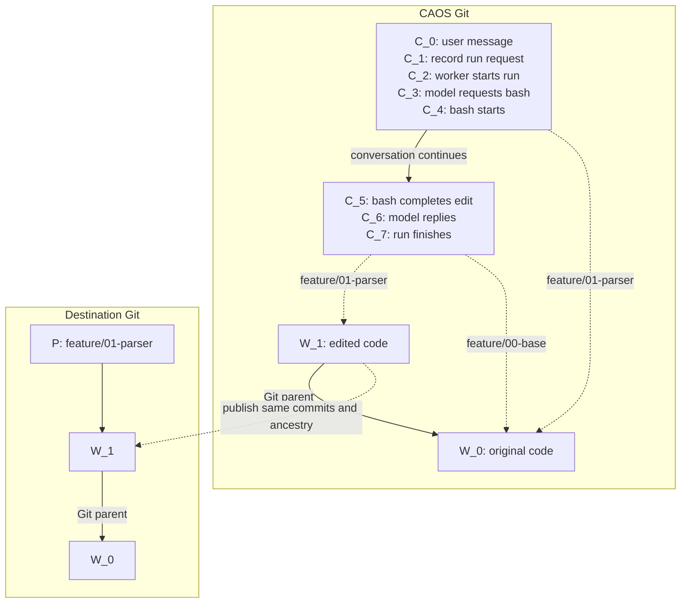

# Conversations, code stacks, and publication

Conversations record content and execution in Git. They reference ordinary
code commits through gitlinks. Files and folders organize source trees and
review boundaries; a publication destination is optional until publishing.
The TUI browses this filesystem read-only, showing file contents or the diff
between adjacent code boundaries.

Local path imports copy disk contents into ordinary conversation files and
folders. Importing a Git revision preserves a code commit and its ancestry as
a gitlink. Editing ordinary content changes `C`; editing a gitlink's contents
also creates a new `W`.

| Thing | Where | Meaning |
| --- | --- | --- |
| `C` | CAOS Git | Conversation content in its tree; execution events in its commit message. |
| `W` | CAOS Git | An ordinary code commit, referenced by an entry in a conversation tree. |
| `P` | Destination Git | A publication branch pointing to an existing `W`. |

Many `C` commits can reference the same `W`. Execution bookkeeping does not
create a code change. A named PR boundary can span many `W` commits.



This example dispatches bash to a worker; each listed `C` is a separate commit.
Editing the named snapshot advances its `W`; the base stays unchanged.
Publishing pushes that exact code commit.

## Conversation commits

**Trees hold canonical content; commit messages hold execution history.**

The tree contains the title, canonical transcript, ordinary conversation files,
and code references. Protocol metadata lives under `.caos/`; ordinary content
and code references live directly at paths outside it. The format marker in
`.caos/format` is `caos-conversation-v5`.

Structured commit messages record run requests, worker claims, tool calls and
results, and background/subagent activity. The TUI derives the latest relevant
state for each operation by replaying those events.

A normal `C` parents the previous `C`; a new root starts from a fixed genesis
commit. Forks retain their source history through a Git parent, which identifies
their origin. Conversation parent edges never point to code commits.

One canonical, **unsharded** transcript lives under `.caos/transcript`.
Earlier versions are available through conversation history.

### Why recording a run is a separate commit

1. Commit the user message as `C_0`.
2. Build a computation request using `C_0` as its input snapshot. Computing
   its hash creates no conversation commit.
3. Create `C_1` with an event recording that request's hash, input snapshot,
   model/settings, and queued status.

The request hash depends on `C_0`; including it inside `C_0` would make the
hashes depend on each other. Step 3 identifies the concrete run to execute.

The worker subsequently records that it has started the run. Model responses
and run completion also create `C` commits. Dispatched tools, such as bash,
record separate start and completion commits. Inline tools, such as `read`
and `edit`, record completion without a separate start commit. An event-only
commit can reuse its parent's tree.

Events are replayed in first-parent order, never by timestamp. A fork starts a
new execution context while retaining ancestral tool results needed by its
canonical transcript. Forking requires a quiescent request; it does not resume
the source's background work.

## The agent's filesystem

The harness supplies source-tree organization and publication conventions to
every model call, including subagents. Agents preserve bases, organize review
boundaries, and integrate delegated changes using ordinary file operations;
users specify the desired work and review structure. Imports conventionally live
at `imports/<repo>/base`. A sibling `<import-path>.source.json` records available portable
repository details, so sibling imports can come from different repositories.
The agent preserves imports. To build a PR stack, it copies an
imported gitlink to `<feature>/00-base` and `<feature>/01-parser` before editing.
Publication destinations are confirmed in the client preview. Provenance can
suggest a destination, but never selects one silently.

Commands start at the conversation root. Memories, skills, notes, and source
trees share one path space. A commit-valued entry appears as a directory whose
contents are that commit's tree; a regular file containing a SHA remains a file.
Nested commit entries follow the same rule.

The file tools and grep use conversation-relative paths, such as
`memories/project.md` or `feature/01-parser/README.md`. Grep traverses source trees.
Bash runs from this root, with an optional relative `cwd` for a single call.
Its `paths` list is always relative to the conversation root: declared
directories include their descendants; undeclared contents remain lazy.

Use ordinary filesystem operations to organize content. This example starts
with a gitlink imported at `imports/caos/base`:

```sh
mkdir -p feature
cp -a imports/caos/base feature/00-base
cp -a imports/caos/base feature/01-parser
# After completing the first change, start the next:
cp -a feature/01-parser feature/02-errors
```

A writable projection records each source directory's original commit in an
extended attribute. `mv` and `cp -a` preserve it. On storage, an unchanged
directory retains the exact commit, including signatures; edited content
becomes a child commit. Ordinary directories remain Git trees. Copying without
preserving extended attributes copies files but loses the commit boundary.
This metadata is local to the projection, not another conversation registry.

Inside bash, `caos checkout <commit> <destination> <paths...>` adds a commit
already available in CAOS; `.` loads its whole tree. Local or remote repository
imports happen through the client. No host filesystem path is implicitly
available inside a worker.

Call a repository tool with `run_tool` and a conversation-relative path, such
as `feature/01-parser/caos-tools/test`, plus its arguments. The harness resolves
the tool against the captured snapshot and dispatches its content-addressed
request. Its input is the outermost source tree on that path: the first
commit-valued entry reached from the conversation root, even if the tool lies
inside another gitlink. A tool outside source trees receives the conversation
tree. Repository tool schemas and instructions are shown with their owning paths.

A shell result may change conversation files and several source trees together.
Apply it atomically against the captured input: retain concurrent unrelated
edits, reconcile concurrently edited source commits, and retain a conflicting
proposal without installing half the operation. Agent tools cannot change
conversation protocol metadata under `.caos/`.

## Code references and stack directories

Code references are Git commit-valued tree entries (gitlinks, mode `160000`).
A reference's value is a `W`; that commit's
identity does not depend on the repository from which it was fetched.

References may occur anywhere outside `.caos`. The TUI walks ordinary
directories and lists each commit-valued entry it reaches, stopping at that
entry. Nested gitlinks remain traversable by file tools but are not separate
TUI source-tree targets.

A single reference is enough for simple work. For reviewable changes, copy an
imported gitlink into a feature directory and follow this convention:

```text
paintbot-feature/
  00-base          -> W_0   # preserved starting commit
  01-add-targeting -> W_1   # first PR boundary
  02-improve-it    -> W_2   # second PR boundary, currently being edited
```

Each sibling gitlink names a snapshot. In ascending filename order, the first
is the base; every later entry is a review boundary. Number prefixes make this
order clear but have no special syntax. Names such as `dirty` have no special
meaning. Work directly in a named boundary, then copy it to the next name when
starting another reviewable change. Earlier snapshots remain unchanged.

The browser lists entries in descending filename order. It compares a selected
gitlink with the next gitlink below it; a folder previews its newest two
gitlinks. The oldest entry has no comparison and shows content. Publication
uses the same order. Naming a boundary does not squash intermediate Git commits.

Work, delegation, merging, tests, and review boundaries need only the recorded
commits. No publication destination is required to prepare a stack. Fetching a
newer remote tip does not integrate it; the agent must merge it explicitly.

Creating, copying, renaming, or removing references is ordinary tree editing.

### Editing, updating, and delegating

Tools receive immutable input snapshots. Capture these when work starts so
changing UI selection cannot redirect an in-flight operation. Git operations
such as merge name the source tree they operate on; filesystem tools share
the conversation root.

The agent updates a stack using ordinary tools: import the remote commit,
merge it into the chosen entries, and move or copy directories as needed.
There is no stack-update operation or background refresh of remote branches.
Directory ordering does not replace integrating Git histories.

Subagents start from one content tree with fresh protocol metadata. By default
they receive all conversation content; optional `paths` selects files,
directories, or gitlinks to copy at the same paths. Select a gitlink as a whole
source tree; use ordinary file edits for finer changes inside it.

`harvest_agent` applies the child's changes since its initial snapshot, optionally
restricted by `paths`. It uses the same atomic application as file tools:
ordinary files and multiple source trees can arrive together, unrelated parent
edits survive, and conflicts retain the proposal without partial application.
Child identity, initial conversation head, run request, and terminal head are
recorded in events; content is read from those commits.

### Starting a client

The client starts from a CAOS harness independently of target code. A
conversation begins from an optional content tree; without one it starts empty.

The invocation names the workers with typed image arguments, for example
`caos tui --llm-step:@=std/llm-step --llm-call:@=std/llm-call`.
Paths resolve in the harness, not an attached source tree. Hash and Git-locator
image arguments also work; no root DEPS entry is required.

Add `--import imports/caos/base` to snapshot the launching checkout
at that exact path. Add `--base HEAD` (or another revision) to import a Git
commit instead. Cloud sessions likewise start from a stable CAOS client repository/environment and
attach target code afterward. This also makes bootstrap caching independent
of the target repositories.

Startup checks local credential configuration without resolving worker images.
The sidebar reads conversation metadata; opening or modifying a conversation
validates its history. Reader grants are resolved when a request is prepared.

Credentials, server choice, and client caches remain local. Checkout destinations
are local preferences keyed by server, conversation, and gitlink path. Neither a
code commit nor a publishing URL identifies a directory on the user's machine.
These preferences survive harness updates; renaming a gitlink requires choosing
its checkout destination again.

## Publication

Select a stack directory and choose its destination in the client:

- Repository and external base branch: explicit fields in the preview.
- Branch names: entry paths, such as `paintbot-feature/01-add-targeting`.
- PR bases: the external branch for the first change, then the preceding
  boundary's branch for each subsequent PR. The oldest sibling is the base,
  so it does not become a PR.

The client remembers confirmed destinations locally by server, conversation,
and stack directory. Without a remembered choice, it can suggest provenance
from an imported gitlink matching the stack's oldest commit exactly. Conflicting
origins give no automatic suggestion. The user can edit all suggested values.
Import provenance describes origin; it is not publication policy. No `.base-url`
file is read or required, and a nearby metadata file cannot silently retarget a push.

Press Enter to fetch the chosen destination and inspect a preview, then Enter
again to publish. Changing the selection or destination requires a fresh preview.

The TUI performs publication on the client host using its Git and GitHub
credentials; no local working checkout is required. The preview captures the
code commits, destination branches, PR bases, and current remote tips. After
confirmation, push those exact commits and ancestry,
then open or reuse the PRs. Reject changed content, changed boundaries, remote
drift, unresolved conflicts, and a PR base not incorporated into the code.
Preparation, builds, and tests happen before previewing; publishing never runs
an agent or changes code.

Find existing PRs by confirmed repository and branch. Inspect destination refs
after an interrupted push before retrying. Any recovery events belong in commit
history.

Reject invalid or colliding derived branch names visibly. A renamed path changes
the proposed destination, which appears in the preview.

## Client interactions

- `Ctrl+O`: browse conversation files and source-tree diffs. Highlighting an
  entry previews it; arrows navigate folders and gitlinks. The whole browser
  is read-only, including `.caos`.
- `/import <path> <source> [revision]`: import at an unused conversation path.
  A local file becomes a file; a local directory becomes an ordinary folder,
  using the current disk contents, including uncommitted and untracked files.
  Directory imports honor `.gitignore` and repository-local excludes, and omit
  `.git`. Ancestor ignore rules apply when importing a repository subdirectory.
  Symlinks and executable bits are preserved. The source need not be a
  Git repository. No source index, branch, or file is changed. Quote paths
  containing spaces.
  For example: `/import imports/notes "/home/ubuntu/my notes"`.
  A remote URL, or a local repository with an explicit revision, imports a commit
  as a gitlink instead. Remote URLs without a revision use their default branch.
  For PR work with ancestry, use `/import imports/caos/base /path/to/caos HEAD`.
  A sibling `<import-path>.source.json` records a portable `repository` URL and an optional
  `default_branch` when importing from Git. Local discovery reads `origin` and
  `origin/HEAD` without network access; remote imports read the advertised default.
  Local paths and credential-bearing URLs are omitted. Existing differing
  provenance is rejected, not overwritten. This ordinary file informs the agent
  and can prefill the publication preview when the stack base matches the import.
  Importing does not choose a publishing destination or associate a local checkout.
- `Ctrl+L`: check the selected code snapshot out in its remembered local directory.
  If none is selected, prompt for `/checkout <directory>`.
- `/checkout <directory>`: choose an existing clean Git checkout or an empty/new
  directory, check out the selected commit with detached HEAD, and remember the
  destination locally. Relative paths are resolved from the launching directory.
- `/update-tree <message>`: submit local edits to the selected code snapshot
  with a user message.
- `Ctrl+P`: choose and preview the selected directory's review boundaries.
  Space selects entries; `e` edits the repository and external base branch
  (Tab switches fields, Ctrl+U clears). Enter loads the remote preview; a second
  Enter confirms publication. Escape closes the preview.
- `/publish-branch`: confirm a repository and push the selected snapshot without
  creating a PR. A base branch is not required.

The browser pins the conversation head when opened; refresh loads the latest
head. Ordinary files show contents. Inside a source boundary, files show their
diff against the preceding boundary, including deleted files. The preview labels
the compared boundaries and hashes. There are no shell commands or Apply controls.

The client handles host-side imports, checkout, and publication. The agent
organizes conversation content using files and folders. There is no active
source tree in execution: file tools use conversation-relative paths, and Git
operations explicitly name their target. UI selection cannot retarget a run.

## Scope

Separate stack directories can attach separate repositories. Consuming
unpublished code across them requires explicit dependency configuration.
Git-by-hash endpoints, automatic DEPS projection, conversation merging, and
transcript compaction commands are not currently implemented.
